# DST - Dune Server Tool

> By Coastal (discord @allcoast)

Windows operations app for **Dune: Awakening** Self-Hosted servers and local
Solo saves.

[](https://github.com/coastal-ms/DST-DuneServerTool/actions/workflows/lint.yml)
[](LICENSE)
[](https://github.com/coastal-ms/DST-DuneServerTool/releases/latest)

**[Website and feature tour](https://coastal-ms.github.io/DST-DuneServerTool/) ·
[Install guide](https://coastal-ms.github.io/DST-DuneServerTool/install) ·
[Changelog](CHANGELOG.md) ·
[Discord](https://discord.gg/tj2x7cywSC)**

Current stable release: **v15.0.0**

Confirmed compatible with Dune: Awakening **1.4.10.4**.

## What DST does

DST replaces routine SSH, Kubernetes, PostgreSQL, INI, and Hyper-V work with
guarded controls in one native Windows app.

### Self-Hosted

- Monitor VM, battlegroup, pods, ports, memory pressure, spice, and maps.
- Start, stop, restart, update, and diagnose the Funcom server stack.
- Edit server and local-client INIs through typed, backed-up controls.
- Manage PostgreSQL backups, restores, schedules, imports, SQL, and migrations.
- Administer players, bases, storage, blueprints, Landsraad, and the Exchange.
- Run Duke's native Market Bot with formula or market-follow pricing.
- Manage one local VM or a separate Hyper-V host over LAN.
- Use the responsive full Browser Portal from a phone, tablet, or PC with
  optional host-managed Owner and Admin accounts.
- Use Tailscale Funnel and the Browser Portal for new remote setups. v15 keeps
  existing Cloudflare custom-domain configuration but disables its legacy portal
  by default; the host can explicitly re-enable it in local Settings.

### Solo Mode

- Connect one local PTC Solo save without Self-Hosted setup.
- Validate wrapper, SQLite integrity, foreign keys, schema, and character count.
- Create, restore, and delete retained backups.
- Edit typed Solo and confirmed Engine settings.
- Manage items, packages, vehicle kits, cosmetics, currencies, and fillables.
- Max augments and run verified specialization, Find the Fremen, and skill actions.

Solo mutations require Dune to be closed. DST retains the current save, writes
atomically, verifies the result, and rolls back automatically on failure.

### Command Deck (opt-in)

Classic remains the default until **Try Command Deck** is explicitly selected.
The two layouts are mutually exclusive, and a saved opt-in survives upgrades.

The themed home defaults to the **server-health dashboard**, with the same
palette, navigation, and existing operational panels. **Spatial view** switches
to the globe; **Dashboard** or **Disable 3D** returns to the health dashboard.
This view preference is saved independently of the theme and classic-layout
choice. The non-spatial view is not an inactive planet/splash screen.

The optional **spatial workspace** is a rotatable Arrakis
globe with a smooth base, separate terraced regions, surface-mounted location emblems, and
curved Hagga-origin connections. The globe replaces the introductory headline
and small command table. Drag in either direction to turn it, or enable
**Auto rotate**. Selecting a map never rotates, translates, or refits the scene.
Map objects can also be selected through the equivalent accessible list.
The 3D emblems are rigid children of the planet, with their bases conformed
to its curved surface. They do not billboard toward the camera or float on a
view-depth offset. Turning the globe turns its landmarks with it; the planet
occludes far-side geometry and blocks clicks through its surface.
The sphere retains 75% of its original world diameter. Camera framing fits the
available viewport without changing geometry or relative icon scale. Emblems adapt to the actual active-location
count: small sets use larger models (2x the base icon scale with up to five
locations), then shrink progressively as more maps are added. This excludes
the login Overmap and preserves relative region sizes and grounded bases.
Selection updates an inspector; the tool dock and finder open existing guarded
workspaces. Original location markers distinguish Hagga Basin's caprock,
the Deep Desert's stepped ridge, settlement architecture, wrecks, and testing
stations. **Overmap is the login map/world context**, not a peer destination
symbol. **Hagga Basin is the connection hub**: every line and optional signal
runner originates at its reported instance. If Hagga is absent, no replacement
hub or connections are invented.
Deep Desert has the largest footprint, followed by Hagga and the smaller
settlements/instances; scale does not depend on status-list order.
Fixed regional formations are expressed as stepped shelves and escarpments.
Decorative landforms never create server entries.
The core landmarks retain their relative arrangement: Hagga at the hub,
Deep Desert northwest, Harko south, and Arrakeen northeast. Other locations and
additional instances occupy the largest remaining gaps around the whole sphere,
not a single crowded hemisphere. The base sphere is completely smooth: no
displacement, bump map, noise texture, or dimple shading. The separate terraced
relief is authored illustration, not surveyed Arrakis geography. Far-side
markers are occluded, not clickable through the globe.
The sphere and the lowest terrain boundary share the same lavender material
color; terrain fades into broad darker interiors. Geometry is deterministic
and remains stable across reloads. This is illustrative artwork, not surveyed
geography or a change to the selected interface palette.
The terrain rotates rigidly with the planet
and never moves or disappears to accommodate maps: users can place emblems
on top, and their foundations follow the actual terrain height on movement
and reload. A single 1024-pixel directional shadow map grounds terrain and
landmarks and refreshes for geometry/orientation changes, not travel dots.
Fixed sunlight comes from screen top-right, with restrained fill and real
directional shadows. It does not follow local time, game time, or globe rotation.
**Move maps** lets you press, hold, and drag any location emblem directly on the
globe. Release to save; **Done moving** ends arrangement. No prior dropdown
selection is needed. Hold the right mouse button and drag to rotate the globe
without leaving Move maps. The browser context menu is suppressed only on that
canvas while arranging. Four move buttons and arrow keys provide a keyboard/touch
alternative. Auto rotation pauses during arrangement; Escape cancels a drag.
**Hide globe controls** hides the strip without changing any active mode.
**Show controls** always remains available and identifies Move maps when active.
Dragging beyond the silhouette clamps to the rim. Foundations reconform to the
terrain, Hagga routes, and the permanent text labels follow while dragging.
Positions are saved automatically in this browser using versioned normalized
sphere coordinates. **Reset map positions** restores default placements without
changing the camera. **Reset view** releases gestures and restores fitted zoom
and orientation without discarding placements. No game/server position changes. Named sietches
retain separate placements across row reorder and temporary disappearance.
Indistinguishable duplicate instances cannot be moved until the source provides
a unique map/name pair, rather than risking a saved position binding to another
instance. Renaming a sietch starts a new layout identity. Storage corruption or
blocked saving is reported explicitly without claiming persistence.
Camera zoom is saved separately at **50-300%** of the fitted view. Use **+**, **-**,
**Fit**, or the wheel over the globe; Ctrl/Meta browser zoom is not intercepted.
Rotation, selection, refresh and navigation preserve the chosen zoom. Deliberate
zoom may clip the 3D scene inside its plot, never the controls or dock.
Their visual reference is the community wiki's
[Overland Locations](https://awakening.wiki/Overland_Locations).
No wiki image or game texture is bundled. These are stylized symbols, not real
terrain, measured distances, live player coordinates, or the current DD seed.
Unmapped locations use an explicitly labeled neutral marker instead of invented
geography. Only maps reported by the server appear in the object list.
Technical-to-display-name associations were checked against the
[map-name conversion table](https://github.com/Icehunter/dune-admin/blob/be9a8b6447e33be37152fdbd99b9c087adadfbde/db-routines/functions/misc/upgrade_map_name__1args.sql)
and [map-name catalog](https://github.com/Red-Blink/dune-awakening-selfhost-docker/blob/741f54577007c3f1435131d22c5b25fb31bb1a97/console/web/src/features/maps/mapNames.ts).
Unverified DLC/private-room associations are not guessed.
No AI model or service is used by this interface.

3D starts only after choosing **Spatial view** (or restoring that saved choice).
Its renderer is a separate lazy
chunk, renders on interaction when motion is disabled, caps pixel density,
and releases resources when disabled. **Signal runners** pulse outward from
Hagga along continuous surface arcs once 3D is enabled, capped at 24 fps, and can
be switched off. Each endpoint is green when ready and red when not ready, with
a gradient between mismatched endpoints; unknown readiness is neutral. A route
is fully green only when both endpoints report ready. A depth-tested dark backing
and a thicker moving head keep the colored routes readable. Readiness updates recolor
the arcs without rebuilding the globe. These pulses are not live
traffic indicators, respect reduced motion, and pause offscreen or in a hidden
window. Auto rotation uses the same bounded, reduced-motion-aware scheduler.
**Simulated travel** adds cyan dots matching the map beacons, with long fading trails on
varied paths around the globe. These are ambience, not live users, aircraft, or
measured traffic. They have their own toggle, share the bounded animation
scheduler, disappear under reduced motion, and pause offscreen or when hidden.
3D supports up to **13 reported location instances**, excluding the
containing Overmap. Above that limit, the renderer is released and **every**
location is shown in the 2D selection list; no partial 3D subset is displayed.
Spatial is a one-screen operational dashboard: server status and observation
time remain visible, with controls in a dedicated bottom strip and the dock
in a separate row below the globe. The status roster is plain floating text
inside the lower-left plot, not a sidebar. Rows read **name - status - count**,
ordered Overmap, Hagga, Deep Desert, cities, then other maps. The block grows
upward; long lists scroll internally without reversing reading order.
A compact **Select map** control retains keyboard access. Disabling 3D
returns to the themed health dashboard; graphics failure or exceeding the map
limit retains the complete 2D map list.
If graphics fail, the object list,
inspector, and tools remain available. Keep experimental 3D previews in a separate
browser or app window, not an embedded development-host canvas.

Clicking a location (or deliberately selecting it with accessible controls)
opens a compact in-place panel with identity, reported state, player count,
server age and observation time. It does not fetch or list player names.
Hovering or dragging does not open the panel.
Per-map latency is not exposed by the status API and remains **Not reported**,
not inferred from refresh time.
Every facing location also has a compact, text-only name and player count just
above its top beacon, with a shadow for readability. These labels track globe
rotation and dragging, disappear on the far side, and update through the normal
status refresh without another polling loop or scene rebuild.
The inspector overlays the right-hand spare space without resizing the canvas
or changing scene position, orientation, framing, or selected zoom. Its deeper
metadata scrolls internally when needed; controls and dock stay available.
Clicking icons or selecting maps never rotates or centers the globe, including
far-side maps. Orientation remains under drag, Auto rotate, and Reset view only.
Configured sietch names take precedence, with the underlying location shown
beneath them so multiple Hagga instances remain distinguishable.
There is no separate lower Map Health section in Spatial view. Counts come
from the selected server-status row; shared-map instances are identified
without inventing player attribution. Unknown and stale observations remain explicit.
The current status API does **not** expose a per-map heartbeat; the inspector
says **Not reported** and separately shows the last status observation. A
refresh timestamp or decorative animation is never presented as a heartbeat.

The opt-in **Try Command Deck** control in the status bar switches to task-led
navigation and a compact server overview. Search by activity, such as "ammo" or
"backup", to open an existing tool; the search never executes an action.
**Ctrl+K** opens the keyboard-accessible task finder. The shared header, dock,
palette selector, and return-to-world link continue through tool workspaces;
the existing navigation menu remains available on mobile.

The **Workspace palette** selector offers **World Control — Dark**,
**Daylight — Light**, and the existing Dune world/house themes. Colors apply to
the workspace, forms, and 3D selection/connection accents without rebuilding the
scene. The choice is saved locally; **Settings > Appearance** retains custom
color overrides and import/export. Classic keeps its original default.

The overview reuses the shared status snapshot, including its timestamp and
refresh errors, without adding a polling loop. **Detailed overview** retains
the existing dashboard, alerts, and schedules. **Classic layout** restores the
original presentation. The layout choice and classic sidebar size are saved
in the current browser; remote role and platform restrictions still
apply. The experience uses the existing administration APIs, not an AI service.
In the new experience, Players now uses a searchable directory beside a
contextual dossier, with section navigation beside the selected character.
Player and inventory actions use a searchable task list and one focused form,
retaining existing confirmations and live/offline rules. Switching characters
clears the previous character's action form; filtering the directory does not
silently change the current target. **Players > Community tools** exposes the
existing in-game chat command controls, shared `!tp` destinations, and Welcome
Back packages without changing their opt-in defaults or safety gates. Classic
retains the same controls and action lists.
Commands uses the same task workbench while keeping its local-only layout
editor. Bases, market entries, and vehicles have keyboard-accessible detail
panels; fleet search and source labels distinguish reported and sample records.
Operations groups existing tools by task alongside the current observation.
Configuration, data-protection, and settings pages share focused section
navigation without replacing their schema editors or guarded actions. Native
controls and read-only previews follow the selected light/dark palette.
The Spatial dashboard reserves its dock below the globe and controls, without
overlap. In other themed workspaces, the same single dock floats when its natural
footer position is offscreen and returns without a horizontal jump.
The v15 Command Deck is an opt-in alternative to the Classic layout and retains
the same guarded administration behavior.

**Signal**, available through **Settings > Appearance**, is a complete alternative
visual treatment for both layouts: carbon canvas, graphite panels, violet primary
actions, cyan focus, and lime status accents. It applies through the existing
shared tokens to forms, tables, dialogs, and navigation; it does not require an
AI service, new renderer, animation loop, or extra polling. Existing themes and
custom color overrides remain supported.

## Inside v15

Screenshots show the shipped interface using isolated offline states, static
atlas data, or DST's built-in fictional demo roster. No personal server, live
account, or private save is shown. Classic remains the default.

<details open>
<summary><strong>Command Deck (opt-in)</strong></summary>

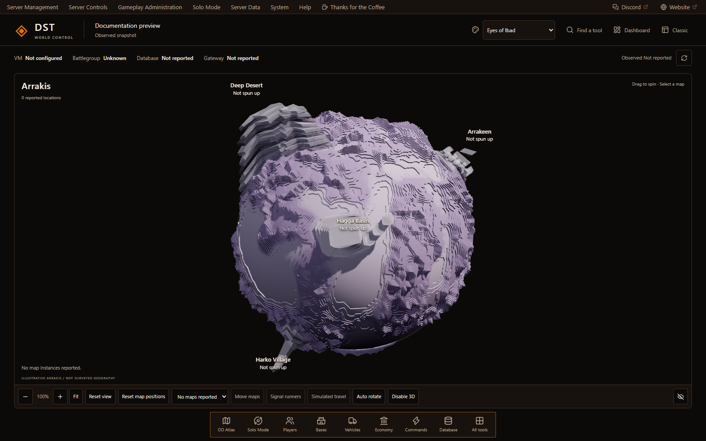

Optional World/dashboard navigation and focused workspaces. The globe organizes
reported status; it is not live game geography.
</details>

<details>
<summary><strong>Server Health</strong></summary>

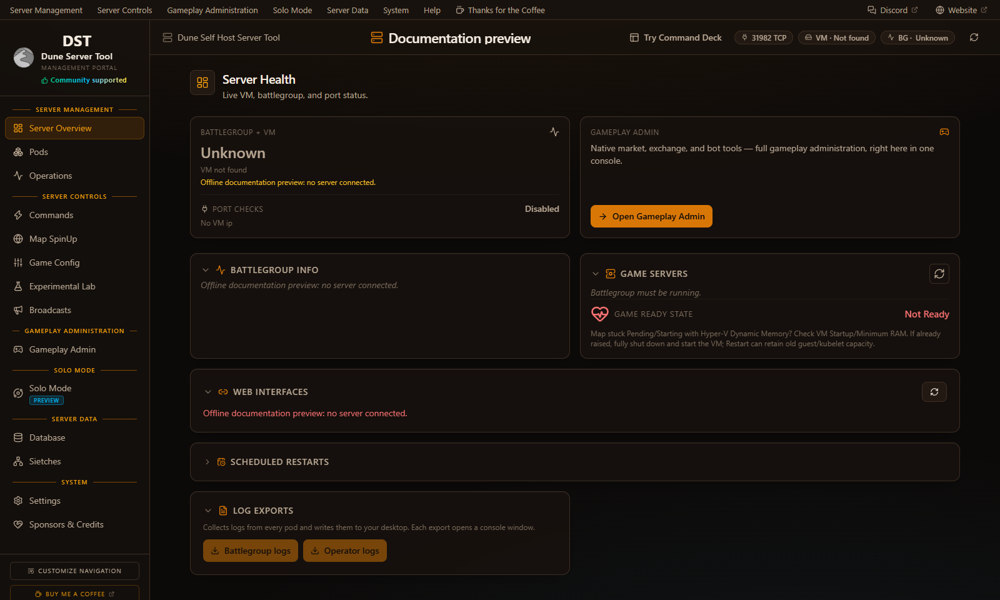

VM and battlegroup state, database and gateway health, game pods, ports, active
spice, scheduled restarts, memory warnings, interfaces, and log exports.
</details>

<details>
<summary><strong>Game Config</strong></summary>

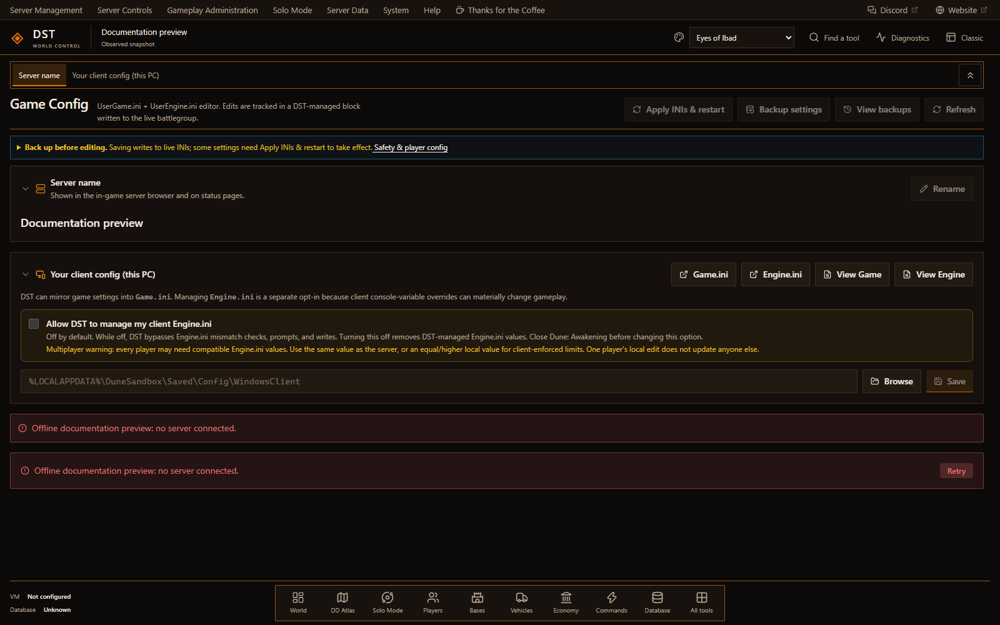

Typed `UserGame.ini` and `UserEngine.ini` controls, Funcom defaults, backups,
DST-managed blocks, local-client mirroring, and isolated Experimental features.
</details>

<details>
<summary><strong>Gameplay Admin</strong></summary>

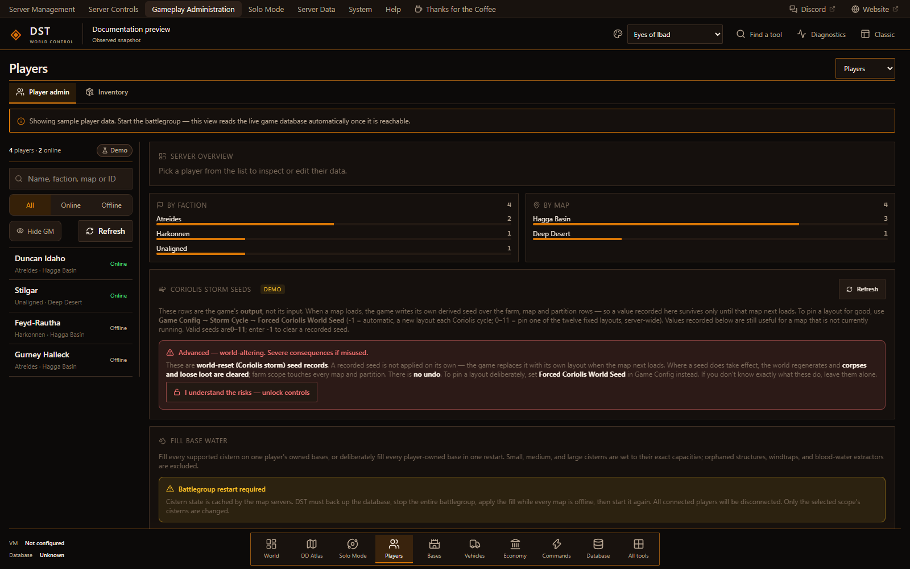

Players, Market, Market Bot, Bases, Storage, Blueprints, Landsraad Houses,
packages, vehicle kits, cosmetics, progression, teleports, and guarded writes.
Teleport tracing is diagnostic; it does not fix game-side teleport execution.
</details>

<details>
<summary><strong>Bases → Blueprints</strong></summary>

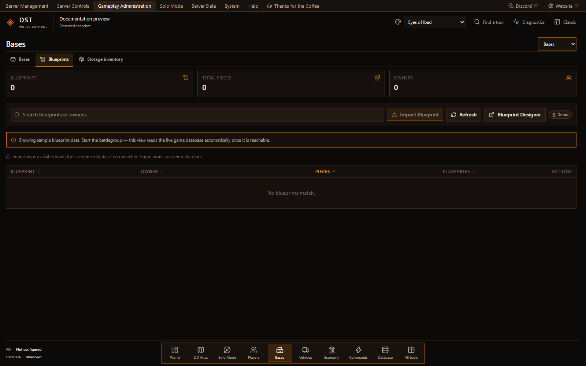

A dedicated Blueprints tab beside base management and storage inventory.
The capture contains no player buildings or imported designs.
</details>

<details>
<summary><strong>Solo Mode</strong></summary>

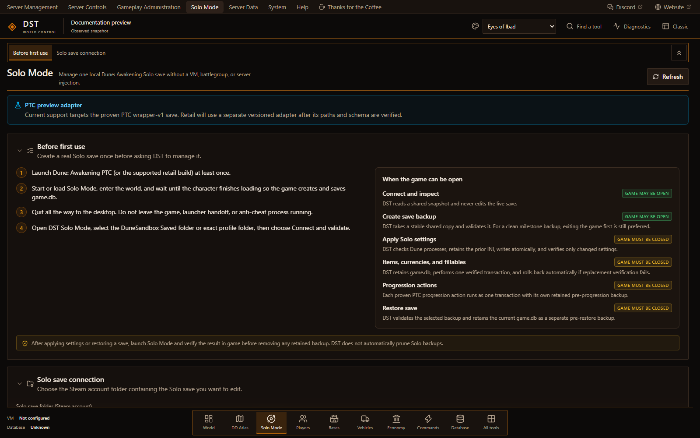

Validated local-save settings, backups, character and inventory tools,
currencies, fillables, cosmetics, packages, augments, and progression.
The current adapter targets the supported PTC save format, not every retail save.
</details>

<details>
<summary><strong>DD Atlas (static)</strong></summary>

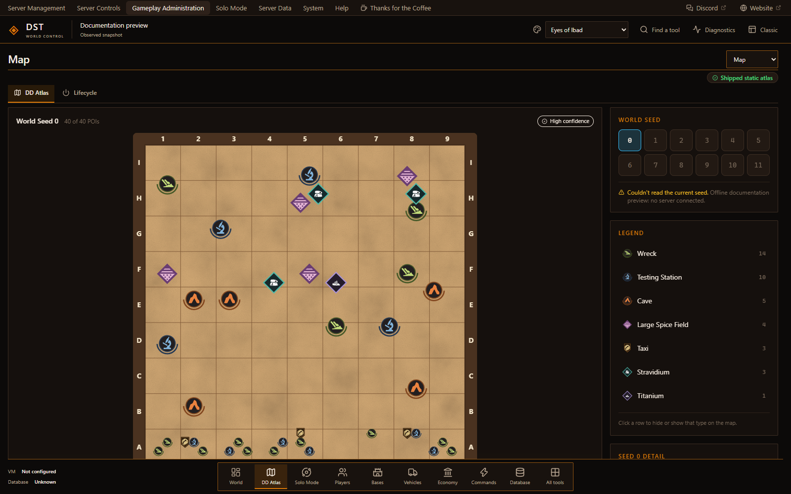

Static POI reference maps for all 12 Coriolis seeds with legend filters,
confidence notes, farm-seed selection, and running-map seed detection when
server data is available. This is not a live map.
</details>

<details>
<summary><strong>Commands</strong></summary>

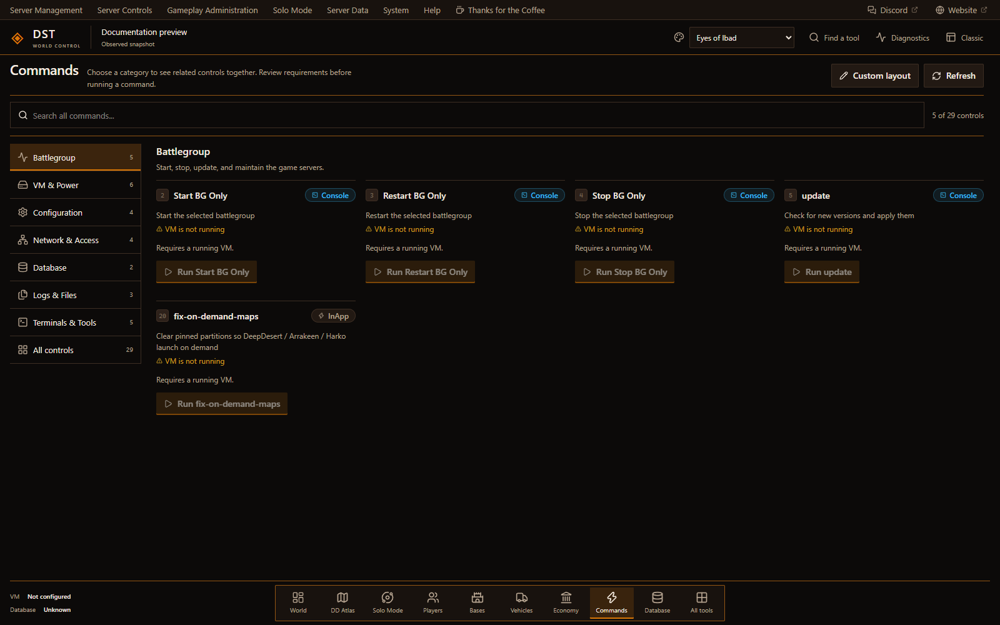

Battlegroup, VM & Power, Configuration, Network & Access, Database, Logs &
Files, and Terminals & Tools. Requirements remain visible before an action.
</details>

<details>
<summary><strong>Database</strong></summary>

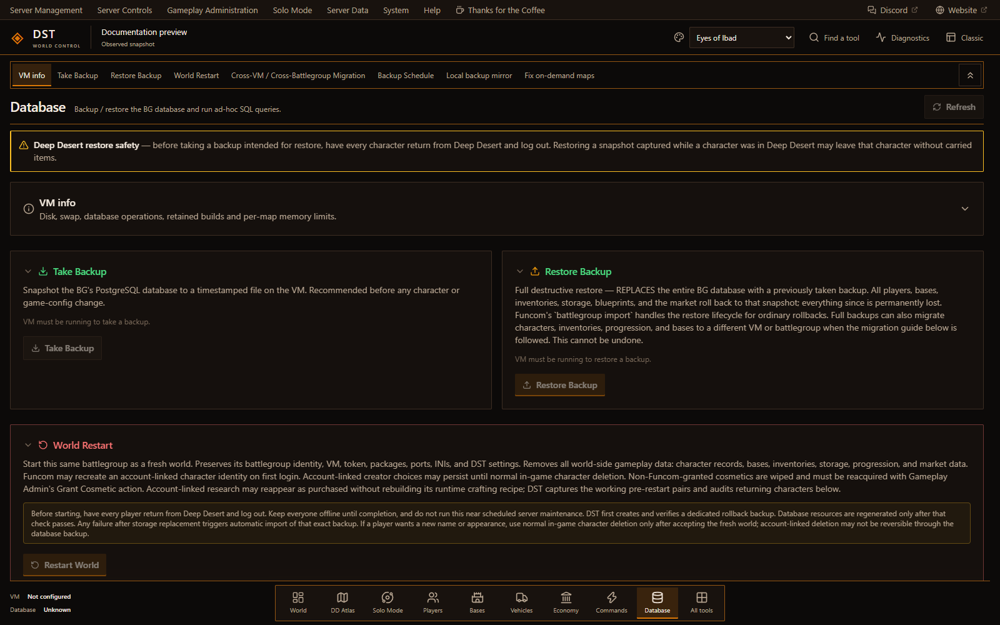

Backup, restore, import, local mirror, scheduling, SQL, migration tools, and
guarded World Restart testing.
</details>

<details>
<summary><strong>Settings</strong></summary>

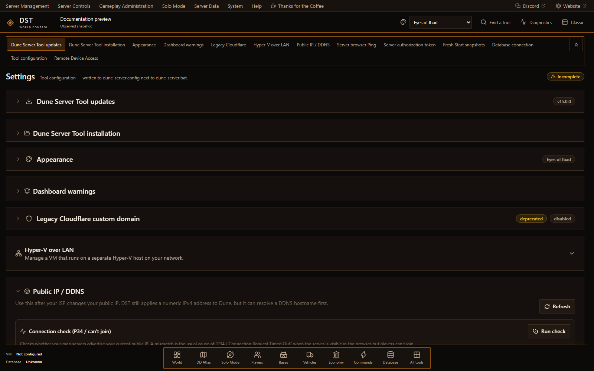

Updates, installation, themes, warnings, Remote Device Access, Browser Portal
accounts, Hyper-V over LAN, Public IP/DDNS, browser ping, and host-local
preferences.
</details>

<details>
<summary><strong>Browser Portal</strong></summary>

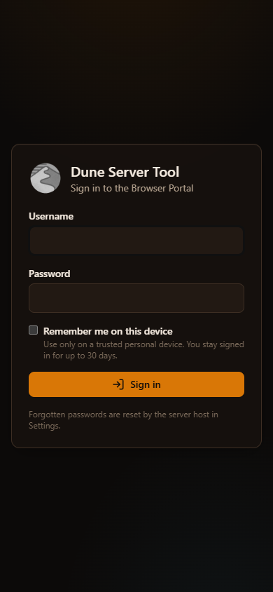

Responsive remote access with host-created accounts. Tailscale Funnel is the
forward path; retained legacy Cloudflare configuration stays disabled by
default until explicitly re-enabled in local Settings. The screenshot is the
offline sign-in screen, not a connected remote session.
</details>

## Safety model

- Local admin portal binds to loopback with a per-launch token.
- PowerShell, Solo Mode, Setup, host paths, credentials, and SSH controls remain
  host-local. Remote Admins also cannot access Game Config, Experimental,
  Database, Sietches, or Settings.
- Destructive actions require explicit confirmation and use narrow write scopes.
- Database and save mutations use backups, verification, and recovery paths.
- Player state determines whether an action requires the player online or offline.
- Experimental features are isolated and never presented as field-proven.
- Secrets are excluded from diagnostics and never stored in repository files.

## Install

1. Download `DuneServerSetup.exe` from the
   [latest GitHub release](https://github.com/coastal-ms/DST-DuneServerTool/releases/latest).
2. Run the installer.
3. Launch **Dune Server** from the Start Menu.
4. Choose an existing local VM, a fresh local install, Hyper-V over LAN, or use
   Solo Mode independently.

### Requirements

- Windows 10 or 11.
- PowerShell 7.
- Microsoft Edge WebView2 Runtime.
- For Self-Hosted: Funcom's Dune: Awakening Self-Hosted Server package, Hyper-V
  locally or on a reachable LAN host, and the VM SSH key.
- For Solo Mode: a supported local Dune Solo save. No VM is required.

Full setup, remote access, Hyper-V-over-LAN, and path guidance:
**[Install guide](https://coastal-ms.github.io/DST-DuneServerTool/install)**.

## Local paths

| Purpose | Path |
| --- | --- |
| Installed app | `C:\Program Files\Dune Server\` |
| Config and state | `%APPDATA%\DuneServer\` |
| Runtime logs and URL | `%LOCALAPPDATA%\DuneServer\` |
| Default VM key | `%LOCALAPPDATA%\DuneAwakeningServer\sshKey` |

## Support and releases

- Questions and community help: [DST Discord](https://discord.gg/tj2x7cywSC)
- Reproducible bugs: [open an issue](https://github.com/coastal-ms/DST-DuneServerTool/issues/new/choose)
- Stable and named test builds: [GitHub Releases](https://github.com/coastal-ms/DST-DuneServerTool/releases)
- Active test guidance: [testing page](https://coastal-ms.github.io/DST-DuneServerTool/testing)
- Full release history: [CHANGELOG.md](CHANGELOG.md)

Diagnostics are available from **Help -> Export diagnostics**. Attach the
generated ZIP to bug reports instead of posting secrets or raw credentials.

## Build from source

Requires PowerShell 7, Node.js, .NET SDK, and Inno Setup 6.

```powershell
pwsh app/installer/Build-Installer.ps1
```

Output:

```text
app/installer/output/DuneServerSetup.exe
```

Fast checks:

```powershell
cd webui
npm ci
npm run build
npm test
```

See [CONTRIBUTING.md](CONTRIBUTING.md) for repository workflow and release
requirements.

## License

DST is released under the [Apache License 2.0](LICENSE). Redistributions must
preserve [NOTICE](NOTICE) and credit Coastal as the original author.
